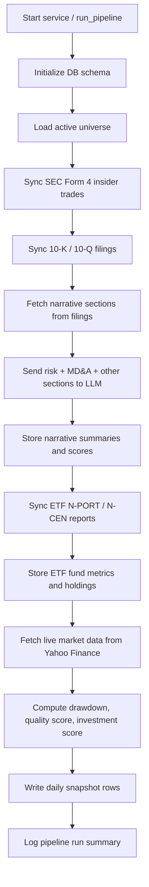
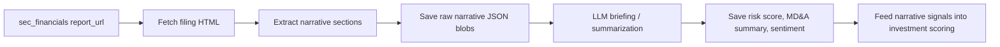

# Drawdown Analyzer - Standalone Python Data Pipeline

This project now uses a `src/` layout. The core package lives under `src/stock_hunter/` and the debug scripts live under `tools/debug/`.

---

## 📁 Directory Structure

```
stock_hunter/
├── README.md
├── requirements.txt
├── run.sh
├── activate_and_run.sh
├── ui/
│   ├── __init__.py
│   ├── app.py
│   └── db.py
├── src/stock_hunter/
│   ├── ai_narrative.py
│   ├── pipeline.py
│   ├── query_db.py
│   ├── schema.py
│   ├── sec_edgar_worker.py
│   ├── sec_etf_worker.py
│   ├── sec_financials_worker.py
│   ├── sec_narrative_worker.py
│   └── service.py
├── tests/
└── tools/debug/
```

---

## 🚀 Quick Start Instructions

### Option A: Standard `requirements.txt` with venv

```bash
source venv/bin/activate
python -m pip install -r requirements.txt
export PYTHONPATH=src
```

### Option B: Pipenv (`Pipfile`)

```bash
pipenv install
pipenv shell
```

---

## 📊 Local Streamlit Dashboard

The project includes a read-only Streamlit app that reads directly from SQLite.

Install dependencies first:

```bash
source venv/bin/activate
python -m pip install -r requirements.txt
```

Run the dashboard:

```bash
source venv/bin/activate
streamlit run ui/app.py
```

Streamlit runs with automatic reload by default, so edits to `ui/app.py` or supporting files will refresh the page while the server is running.

If file watching feels slow or reloads lag, install the optional watchdog package:

```bash
source venv/bin/activate
python -m pip install watchdog
```

Browser URL:

- `http://localhost:8501`
- If Streamlit chooses a different port, it prints the exact local URL in the terminal when the server starts.

How to check whether Streamlit is already running:

```bash
pgrep -af 'streamlit run ui/app.py|streamlit'
```

You can also check the port directly:

```bash
lsof -i :8501
```

If those commands return nothing, the Streamlit server is not running.

What it shows:

- summary cards for active tickers, snapshot rows, financial rows, LLM-enriched rows, ETF rows, and pipeline runs
- ticker search in the sidebar
- ticker overview charts for price history and filing-score trends
- filing history and filing detail for each ticker
- narrative section tabs for MD&A, risk factors, legal, commitments, buybacks, liquidity, and subsequent events
- recent pipeline run history plus a run-details panel
- optional auto-refresh while the backend pipeline is running

The dashboard is read-only. It does not write back to the database.

---

## ⚙️ Running the Pipeline & Daemon Service

### 1. Initialize the SQLite Database

Run the schema module to create `drawdown_analyzer.db` with normalized tables (`universe`, `daily_snapshot`, `price_history`, `insider_trades`, `sec_financials`, `sec_etf_reports`, `etf_holdings`, `eight_k_events`, `drawdown_events`, `drawdown_summary`, `distress_scores`, `congress_trades`, `pipeline_runs`):

```bash
PYTHONPATH=src python -m stock_hunter.schema
```

### Analytics added on top of SEC filing data

Each pipeline run now also computes, per active ticker:

- **Price history backfill** – a one-time 5-year backfill per ticker (then incremental daily updates), stored in `price_history`, so drawdown analysis has real multi-year series to work with.
- **Drawdown/recovery analytics** (`drawdown_analytics.py`) – every peak-to-trough-to-recovery episode at or beyond a 5% threshold, plus summary stats (count by severity, average/median/worst drawdown, average/longest recovery, current drawdown, and historical recovery-probability buckets) in `drawdown_events` / `drawdown_summary`.
- **Financial-distress estimate** (`distress_analytics.py`) – Altman Z-score and a best-effort Piotroski F-score (using year-over-year 10-K comparisons where two years of data exist) blended into a 0-100 `distress_risk_score` with probabilistic wording ("Low financial-distress risk" / "Elevated financial-distress risk" / "Material solvency concerns" / "Insufficient data"), stored in `distress_scores`. Note: Altman Z is designed for non-financial firms and reads unreliably low for banks/insurers by construction — treat it as one signal among several, not a verdict.
- **8-K debt/bankruptcy event tracking** (`sec_eightk_worker.py`) – ingests 8-K filings whose item codes indicate new debt, covenant triggers, refinancing, delisting, auditor changes, or bankruptcy (items 1.01, 1.02, 1.03, 2.03-2.06, 3.01, 4.01), stored in `eight_k_events`. A bankruptcy-item 8-K forces the composite risk score to "high" regardless of other inputs.
- **Insider sentiment scoring** (`scoring.py`) – aggregates `insider_trades` over a trailing 180-day window into a 0-100 score, weighting open-market purchases/sales (codes `P`/`S`) far more heavily than grants, option exercises, tax withholding, or gifts (`A`/`M`/`F`/`G`), so routine equity-comp activity doesn't drown out genuine buying/selling signal.
- **Composite risk / quality / investment scores** (`scoring.py`) – combine the above with live valuation (PE, FCF yield, dividend yield, EV/EBITDA), the LLM-derived filing risk score, and legal/regulatory sentiment into `daily_snapshot.risk_score`, `quality_score`, and `investment_score`.

These run automatically as part of `run_pipeline()` / `stock_hunter.service` — no separate command is needed.

### Score formulas

All scores below are 0–100 unless noted. `daily_snapshot` stores the final values; the source
modules are `scoring.py`, `distress_analytics.py`, and `drawdown_analytics.py`.

#### Insider sentiment score (`scoring.py: compute_insider_sentiment_score`)

Aggregates `insider_trades` over a trailing 180-day window. Each transaction is weighted by its
Form 4 code so open-market buys/sells dominate over routine equity-comp activity:

| Code | Meaning | Weight |
|---|---|---:|
| P | Open-market purchase | 3.0 |
| S | Open-market sale | 3.0 |
| A | Grant/award | 0.3 |
| M | Option exercise | 0.3 |
| F | Tax withholding | 0.1 |
| G | Gift | 0.1 |
| other | — | 0.5 |

```
signed_total      = Σ (trade_value × code_weight × direction)     # direction: +1 buy, -1 sell
weighted_abs_total = Σ (trade_value × code_weight)
ratio             = signed_total / weighted_abs_total              # -1..+1
insider_sentiment_score = clamp(round(50 + 50 × ratio), 0, 100)
```

**How to read it:** 50 = no trades in the window, or exactly balanced buying/selling. **Above 50 = net
open-market buying (bullish signal)** — the closer to 100, the more insider buying dominated. **Below
50 = net open-market selling (bearish signal)** — the closer to 0, the more insider selling dominated.
Because P/S are weighted 6–30x higher than A/M/F/G, a handful of open-market trades can move this
score much more than a large batch of routine option exercises or tax-withholding sales.

#### Drawdown opportunity score (`drawdown_analytics.py: drawdown_opportunity_score`)

Answers "how unusual is the *current* drawdown compared to this ticker's own drawdown history?"

```
if |current_drawdown_pct| < 5:
    score = 20                                       # not really in a drawdown
else:
    score = 40 + (|current_drawdown_pct| / max(avg_drawdown_pct, 1)) × 15
    if worst_drawdown_pct > 0:
        score += (|current_drawdown_pct| / worst_drawdown_pct) × 20
score = clamp(round(score), 0, 100)
```

**How to read it:** higher = the stock is deeper into a drawdown than it typically goes, relative to
its own history — i.e. a more historically-unusual dip. It does not by itself mean "buy"; it's one
input alongside quality/risk into the investment score below.

#### Financial-distress score (`distress_analytics.py: compute_distress`)

Built from the two most recent 10-K filings only (never 10-Q data). Two independent models feed into it:

**Altman Z-score** (classic 5-factor formula, using book values from SEC filings + live market cap for X4):
```
X1 = (current_assets - current_liabilities) / total_assets
X2 = retained_earnings / total_assets
X3 = operating_income / total_assets
X4 = market_cap / total_liabilities
X5 = revenue / total_assets
Altman Z = 1.2×X1 + 1.4×X2 + 3.3×X3 + 0.6×X4 + 1.0×X5
```
Requires at least 3 of the 5 components to be computable, else `null` ("Insufficient data").
Note: designed for non-financial firms — reads structurally low for banks/insurers.

**Piotroski F-score** (0–9; each of the 9 pass/fail criteria below only counts if both years of data
exist; the final score is scaled to a 0–9 range by the fraction actually evaluable):
1. Positive ROA (net income / total assets)
2. Positive operating cash flow
3. ROA improved year-over-year
4. Operating cash flow exceeds net income (earnings quality)
5. Total-debt-to-assets ratio decreased year-over-year
6. Current ratio improved year-over-year
7. No material new share issuance (shares outstanding grew ≤1%)
8. Operating margin improved year-over-year
9. Asset turnover (revenue / total assets) improved year-over-year

**Combining into `distress_risk_score` (0–100, higher = riskier):**
```
base_risk = 15   if Altman Z > 2.99   (safe zone)
          | 45   if 1.81 ≤ Altman Z ≤ 2.99   (grey zone)
          | 80   if Altman Z < 1.81   (distress zone)
          | 50   if Altman Z unavailable
base_risk += (4.5 - piotroski_f) × 4    # shifts risk up/down based on fundamental strength
distress_risk_score = clamp(round(base_risk), 0, 100)
```
Mapped to wording: **0–30 "Low financial-distress risk"**, **31–60 "Elevated financial-distress
risk"**, **61–100 "Material solvency concerns"**. Falls back to `"Insufficient data"` (not a numeric
score) when there isn't enough 10-K history to compute either model — the platform never guesses at
a number it can't support, per the "no absolute bankruptcy prediction" design principle.

#### Risk score (`scoring.py: compute_risk_score`)

Weighted composite, 0–100, **higher = riskier**:

| Component | Weight | Derived from |
|---|---:|---|
| Balance-sheet risk | 20% | `distress_risk_score` above (50 if unavailable) |
| Liquidity risk | 15% | Current ratio: 20 if ≥1.5, 50 if ≥1.0, else 80 |
| Earnings stability risk | 10% | Revenue volatility % × 3 (50 if unavailable) |
| Cash-flow risk | 15% | 20 if operating cash flow positive, else 80 |
| Filing risk factors | 15% | LLM-derived `risk_score` from the latest 10-K narrative |
| Legal/regulatory risk | 10% | 70 if legal-section sentiment negative, 30 if positive, else 50 |
| Drawdown severity | 10% | `min(100, |current_drawdown_pct| × 2)` |
| Insider selling | 5% | `100 - insider_sentiment_score` |

```
risk_score = 0.20×balance_sheet + 0.15×liquidity + 0.10×earnings_stability + 0.15×cash_flow
           + 0.15×filing_risk + 0.10×legal_risk + 0.10×drawdown_severity + 0.05×insider_selling
```
**Hard overrides** (applied after the weighted sum): any bankruptcy-related 8-K (item 1.03) in the
trailing 180 days forces `risk_score = max(risk_score, 85)`; any debt-related 8-K (items 1.01, 1.02,
2.03–2.06, 3.01, 4.01) adds a flat `+8`.

#### Quality score (`scoring.py: compute_quality_score`, stocks only)

Weighted composite, 0–100, **higher = higher fundamental quality**. Each input is linearly scaled
between a low/high band (e.g. revenue growth: -5% → score 20, +20% → score 90; values outside the
band clamp to the endpoint; missing data defaults to a neutral 50):

| Component | Weight | Scaling band |
|---|---:|---|
| Revenue growth & stability | 15% | -5% to +20% YoY revenue growth |
| EPS/net-income quality | 15% | 0% to 25% net margin |
| Free cash flow quality | 20% | 0% to 25% operating-cash-flow margin |
| Profitability | 15% | 0% to 30% operating margin |
| Balance-sheet strength | 15% | 90 if debt/equity < 0.5, 20 if > 2.5, else 55 |
| ROIC/capital efficiency | 10% | 0% to 20% return on assets |
| Dividend/buyback quality | 10% | 0% to 4% dividend yield |

ETFs (and stocks with no SEC fundamentals yet) fall back to a simpler legacy score based on PE
ratio and current drawdown (`calculate_quality_score` in `pipeline.py`).

#### Investment score (`scoring.py: compute_investment_score`)

Weighted composite, 0–100, **higher = more attractive**. Note risk and filing-risk are inverted
(subtracted from 100) since lower risk should raise the investment score:

| Component | Weight |
|---|---:|
| Quality score | 30% |
| Valuation score (legacy PE/drawdown-based score) | 20% |
| Inverted risk score | 15% |
| Inverted filing risk score | 10% |
| Drawdown opportunity score | 10% |
| Dividend score (`20 + dividend_yield% × 15`, clamped) | 10% |
| Insider sentiment score | 5% |

```
investment_score = 0.30×quality + 0.20×valuation + 0.15×(100-risk) + 0.10×(100-filing_risk)
                  + 0.10×drawdown_opportunity + 0.10×dividend + 0.05×insider_sentiment
```

All formulas above are transparent by design (doc section 27, "Reproducibility") — every score can
be recomputed by hand from the columns already stored in `sec_financials`, `daily_snapshot`,
`drawdown_summary`, and `distress_scores`.

### 2. Run as a One-Shot Execution or Background Service Daemon

Run one-shot sync:
```bash
PYTHONPATH=src python -m stock_hunter.service
```

Run one-shot sync while skipping Form 4 ingestion:
```bash
PYTHONPATH=src python -m stock_hunter.service --skip-form4
```

Run one-shot sync while skipping SEC 8-K debt/bankruptcy event ingestion:
```bash
PYTHONPATH=src python -m stock_hunter.service --skip-8k
```

Reset only the filing/narrative table and start fresh:
```bash
PYTHONPATH=src python -m stock_hunter.service --skip-form4 --reset-financials
```

Resume just the LLM narrative scoring pass from the existing `sec_financials` rows:
```bash
PYTHONPATH=src python -m stock_hunter.service --resume-llm
```

Use this when the filing rows and narrative JSON are already in SQLite, but the run stopped during the LLM step.
Do not combine `--resume-llm` with `--reset-financials`.

Run as a continuous background service (e.g. sync every 60 minutes):
```bash
PYTHONPATH=src python -m stock_hunter.service --daemon --interval 60
```

Run the daemon and skip Form 4 ingestion:
```bash
PYTHONPATH=src python -m stock_hunter.service --daemon --interval 60 --skip-form4
```

Or run the 10-K/10-Q financial filings worker individually:
```bash
PYTHONPATH=src python -m stock_hunter.sec_financials_worker
```

### Fresh Start

If you want to rebuild everything from scratch, run these three commands in order:

```bash
rm -f drawdown_analyzer.db
PYTHONPATH=src python -m stock_hunter.schema
PYTHONPATH=src python -m stock_hunter.service --skip-form4 --reset-financials
```

The first command removes the local SQLite database file.
The second recreates the schema.
The third seeds the pipeline from the beginning with a clean financials table.

---

## 🔁 Pipeline Flow

The main service executes in this order:



### What happens at each step

| Step | What the code does | What gets saved to SQLite |
| --- | --- | --- |
| 1 | Initializes schema and seeds the default universe if needed | `universe`, `daily_snapshot`, `price_history`, `insider_trades`, `sec_financials`, `sec_etf_reports`, `etf_holdings`, `pipeline_runs` |
| 2 | Loads all active tickers from `universe` | No new writes |
| 3 | Fetches SEC Form 4 filings and parses insider transactions | `insider_trades` |
| 4 | Fetches 10-K and 10-Q filing metadata and narrative sections | `sec_financials` rows and narrative columns |
| 5 | Fetches narrative sections from filing HTML when missing | `narrative_mda`, `narrative_risk_factors`, `narrative_legal`, `narrative_commitments`, `narrative_buybacks`, `narrative_liquidity`, `narrative_subsequent` |
| 6 | Sends risk factors and MD&A plus other sections to the LLM briefing layer | `risk_score`, `risk_summary`, `risk_sentiment`, `md_a_summary`, `full_sentiment`, `comprehensive_summary` |
| 7 | Fetches ETF N-PORT / N-CEN filings | `sec_etf_reports` |
| 8 | Parses ETF holdings from N-PORT documents | `etf_holdings` |
| 9 | Pulls latest Yahoo Finance prices and fundamentals | `price_history`, `daily_snapshot`, and `universe.market_cap` / `last_updated` |
| 10 | Computes drawdown and investment scores using valuation + narrative risk | `daily_snapshot.quality_score`, `daily_snapshot.investment_score`, `daily_snapshot.valuation_tier`, `daily_snapshot.investment_verdict` |
| 11 | Writes an execution record | `pipeline_runs` |

### Narrative scoring path

The narrative part is the key value-add:



This means the score is not just based on price and valuation. It also includes:

- risk-factor severity
- MD&A tone and summary
- overall filing sentiment
- ETF-specific SEC metrics when applicable
- SEC companyfacts numeric fields when available

### SEC pull strategy

- `Form 4` insider filings are pulled per stock/CIK from the SEC submissions API.
- `N-PORT` / `N-CEN` filings are pulled per ETF/CIK from the SEC submissions API.
- The code does not do one global SEC pull and then try to map everything afterward. It iterates ticker by ticker.
- For stock filings, the worker keeps all `10-K` and `10-Q` rows from the last 365 days.
- The numeric filing fields in `sec_financials` are populated from SEC `companyfacts` data.
- The LLM step runs only on the latest `10-K` per ticker.
- You can skip the Form 4 step entirely with `--skip-form4` when rerunning after the insider data is already loaded.
- Even when Form 4 is enabled, duplicate database writes are prevented by the `insider_trades` unique constraint plus `INSERT OR IGNORE`.

### LLM call budget

- `Form 4` parsing uses no LLM calls.
- `N-PORT` / `N-CEN` parsing uses no LLM calls.
- The LLM is used only for the latest 10-K narrative briefing in `sec_financials_worker.py`.
- Per filing, the current flow can make up to 8 LLM calls:
  - 1 for risk factors
  - 1 for MD&A
  - 1 each for legal, commitments, buybacks, liquidity, and subsequent events
  - 1 for the combined narrative briefing
- With the latest-10-K-only stock pull, the upper bound is `8` LLM calls per stock.
- If a filing is missing some narrative sections, the actual call count can be lower.
- In the current seeded universe, the SEC work is driven by 165 stocks and 21 ETFs, but only the narrative-bearing 10-K / 10-Q rows trigger LLM usage.

If you want to reduce LLM cost later, the next optimization is to add a “summarized already” flag so the worker skips rows that were processed in a previous run.

### Narrative provider switch

The narrative layer is driven by environment variables:

- `NARRATIVE_PROVIDER=openai|cohere|nim`
- `NARRATIVE_MODEL=<provider model name>`
- `NARRATIVE_MAX_RPS=<requests per second>`
- `NARRATIVE_FALLBACK_PROVIDER=nim` to fail over on HTTP 429 from the primary provider
- `NARRATIVE_FALLBACK_MODEL=<fallback provider model name>` if the failover provider needs a different model

If you change `NARRATIVE_PROVIDER`, you also need to set the matching API key:

- `openai` uses `OPENAI_API_KEY`
- `cohere` uses `COHERE_API_KEY`
- `nim` uses `NVIDIA_NIM_API_KEY` and `NVIDIA_NIM_API_BASE`

So yes, the goal is that provider switching becomes an env change, not a code change.
The current implementation already routes OpenAI, Cohere, and NVIDIA NIM through the same narrative interface.
If the primary provider returns HTTP 429 and `NARRATIVE_FALLBACK_PROVIDER` is set, the worker will retry that same request once against the fallback provider instead of stopping the pipeline.

### Database tables at a glance

- `universe`: the active ticker list and classification metadata
- `price_history`: 30-day rolling close/volume history per ticker
- `daily_snapshot`: latest price, drawdown, valuation, and score snapshot
- `insider_trades`: Form 4 insider transaction records
- `sec_financials`: 10-K / 10-Q filing metadata, narrative text, and LLM outputs
- `sec_etf_reports`: ETF filing metadata and fund-level metrics
- `etf_holdings`: holdings extracted from ETF filings
- `pipeline_runs`: run history and execution summary

### Rerun behavior

- `insider_trades`, `price_history`, `sec_etf_reports`, and `etf_holdings` are deduped at the database layer.
- `daily_snapshot` is refreshed per ticker, so the latest run replaces the prior snapshot row.
- `sec_financials` is keyed by filing identity, then enriched in place with narrative text and LLM outputs.
- `pipeline_runs` always gets a new row for each execution.
- If you already loaded Form 4 data and want to avoid the extra SEC requests, use `--skip-form4`.
- If you want to rebuild only the filing/narrative side without touching Form 4 or ETF tables, use `--reset-financials`.
- `--reset-financials` will now rebuild the last 365 days of `10-K` and `10-Q` filings instead of a 5-year filing history.
- If the SEC filing rows already exist and the pipeline failed during the LLM pass, use `--resume-llm` to continue from Step 1b without refetching filings or reprocessing complete LLM rows.

### 4. Query 10-K and 10-Q Financials from the SQLite Database

Run the query helper to inspect top drawdowns, SEC Form 4 insider trades, and 10-K / 10-Q financial reports from terminal:

```bash
PYTHONPATH=src python -m stock_hunter.query_db
```

Or query `sec_financials` directly in SQLite:
```bash
sqlite3 drawdown_analyzer.db
```
```sql
SELECT ticker, form_type, filing_date, fiscal_year, revenue_usd, net_income_usd, operating_income_usd, total_assets_usd, total_liabilities_usd, stockholders_equity_usd, eps_diluted, report_url
FROM sec_financials
WHERE form_type IN ('10-K', '10-Q')
ORDER BY filing_date DESC
LIMIT 20;
```

The numeric columns above are filled from SEC `companyfacts` when available.

To verify that narrative summaries are being written, run:
```sql
SELECT
  ticker,
  form_type,
  filing_date,
  accession_number,
  risk_score,
  risk_summary,
  md_a_summary,
  full_sentiment,
  comprehensive_summary,
  (CASE WHEN narrative_mda IS NOT NULL THEN 1 ELSE 0 END +
   CASE WHEN narrative_risk_factors IS NOT NULL THEN 1 ELSE 0 END +
   CASE WHEN narrative_legal IS NOT NULL THEN 1 ELSE 0 END +
   CASE WHEN narrative_commitments IS NOT NULL THEN 1 ELSE 0 END +
   CASE WHEN narrative_buybacks IS NOT NULL THEN 1 ELSE 0 END +
   CASE WHEN narrative_liquidity IS NOT NULL THEN 1 ELSE 0 END +
   CASE WHEN narrative_subsequent IS NOT NULL THEN 1 ELSE 0 END) AS narrative_sections_present
FROM sec_financials
WHERE ticker = 'AAPL'
ORDER BY filing_date DESC;
```

### Real LLM integration test

Run this only when you want to hit the real provider API:

```bash
RUN_REAL_LLM_TESTS=1 PYTHONPATH=src python -m unittest tests.test_financials_integration
```

It requires:
- `NARRATIVE_PROVIDER=openai|cohere|nim`
- the matching API key in `.env` or your shell environment

## Weekly options premium screener

`premium_screener.py` uses the pipeline's stored analytics plus a live `yfinance` lookup to shortlist
stocks **and ETFs** for short-dated premium-selling strategies (cash-secured puts, put credit spreads,
covered calls). It is a screening aid for narrowing the universe, **not** a trade recommendation or
profit guarantee -- it has no view on broad-market direction, true options-market liquidity beyond
open interest, or position sizing.

```bash
# Cash-secured put candidates (default strategy)
PYTHONPATH=src python -m stock_hunter.premium_screener

# Covered call candidates, limit to 8 final picks
PYTHONPATH=src python -m stock_hunter.premium_screener --strategy covered_call --max-picks 8

# Put credit spread candidates against a specific database file
PYTHONPATH=src python -m stock_hunter.premium_screener --strategy put_credit_spread --db-path pipeline_runs/drawdown_analyzer.db

# Sell strikes further/closer to the money, and a wider/narrower credit spread
PYTHONPATH=src python -m stock_hunter.premium_screener --strategy put_credit_spread --short-otm-pct 0.08 --spread-width-strikes 3
```

What it does, in order (this is the actual execution order -- the code's own step numbering matches):

0. **Macro/regime gate** (`cash_secured_put` / `put_credit_spread` only -- see "Macro/regime gates"
   below for the full detail) -- before touching any individual ticker, checks whether the broad market
   itself and VIX are healthy enough to sell bullish/neutral premium into. If either check fails, the
   run stops immediately with `result["blocked_reason"]` set and nothing else below happens this cycle.
1. **Avoid list** -- hard-excludes any ticker with `distress_scores.risk_level = 'Material solvency
   concerns'`, a bankruptcy-related 8-K in the trailing 180 days, or `daily_snapshot.risk_score >= 65`.
   Insider selling is intentionally **not** a hard exclude: this universe is mega-cap-only, where
   executives are paid largely in equity, so routine (often pre-scheduled 10b5-1) diversification
   sales are normal regardless of outlook, and testing showed little correlation between heavy insider
   selling and near-term price direction for these names. Instead, insider activity (distinct
   open-market sellers and total dollar value sold, trailing 180 days) is surfaced as informational
   `#Sellers` / `InsSel$M` columns on every candidate so you can weigh it yourself -- it still
   contributes a small weight inside `daily_snapshot.risk_score` itself, so it isn't entirely ignored,
   just not treated as disqualifying on its own.
2. **Strategy fit ranking + trend filter** -- from what's left, `cash_secured_put` and
   `put_credit_spread` additionally require the live price to be above its trailing `--sma-period`
   (default 50) day simple moving average (computed from stored `price_history`) -- both are
   bullish/neutral strategies, so a name in a confirmed downtrend is rejected with the specific
   price/SMA values shown, same as any other rejection reason. `covered_call` is exempt, since it's
   often written specifically to generate income on a name that's lagging. Survivors are then ranked by
   `drawdown_opportunity_score` (cash-secured puts / put credit spreads -- you want a name pulled back
   further than usual) or `investment_score` (covered calls), after a minimum `quality_score` bar, and
   the top `--pool-size` proceed to the more expensive per-ticker checks below.
3. **Earnings exclusion** -- drops any candidate with an earnings date (via `yfinance`'s calendar)
   inside the next 7 days, since an earnings print is the most common way a short-dated premium trade
   blows up.
4. **Options chain check** -- pulls the nearest ~1-week expiration (4-10 days out) via `yfinance`, then:
   - **cash_secured_put / covered_call** (single leg): picks a strike `--short-otm-pct` (default 5%)
     out-of-the-money -- below current price for puts, above for calls -- rather than at-the-money.
   - **put_credit_spread** (two legs): sells that same OTM strike and buys a further-out-of-the-money
     protective put `--spread-width-strikes` (default 2) strikes lower, then reports full spread
     economics priced off a **conservative bid/ask fill** (sell the short leg at its bid, buy the long
     leg at its ask) as the primary `Credit`/`MaxLoss`/`RoR%`/`BrkEven` figures -- not the more
     optimistic mid-price, which assumes a fill you might not actually get. The mid-price value is
     still shown as a secondary `MidCr` reference column (upside if you get filled better than the
     conservative assumption), but a spread that isn't a genuine credit even at the conservative fill
     is not viable and is skipped outright.
   All contract types compare implied volatility to trailing realized volatility (computed from stored
   `price_history`) as a rough "is the premium rich enough to bother selling" signal, and attach a
   `ProbOTM%` column -- see "Probability of profit" below.
5. **Correlation diversification** -- greedily selects the final candidate list so no two picks exceed
   a 0.70 trailing 90-day return correlation, avoiding a final list that's secretly one concentrated
   sector bet.

**Probability of profit (`ProbOTM%`):** every candidate includes a Black-Scholes estimate of the
probability that strike finishes out-of-the-money at expiration (for a put, price finishes above the
strike; for a call, below it), computed from that contract's own implied volatility, the live spot
price, and days to expiration (`--risk-free-rate`, default 4.5%, is the only external assumption). This
is a **model estimate, not a guarantee or a backtested figure** -- it assumes lognormal returns (the
standard Black-Scholes simplification, which real markets don't perfectly follow) and estimates the
probability of finishing OTM at expiration specifically, not the probability that this strategy's actual
exit rules (profit target / loss stop / early close) end up profitable.

**Price freshness:** `quality_score`, `risk_score`, and `drawdown_opportunity_score` come from
`daily_snapshot`, i.e. whatever the last full pipeline run computed -- these aren't intraday-sensitive.
The displayed `Price` and every OTM strike target, however, are refreshed with a live `yfinance` quote
at screener runtime (not the potentially stale stored price), since strikes need to match the current
market, not wherever the price was when the pipeline last ran. If a live quote can't be fetched for a
ticker, it falls back to the stored price and is marked with a trailing `*` in the report.

**Drawdown / 52-week-low context:** every candidate row also shows `CurrDD%` (current drawdown from the
52-week high, negative), `AvgDD%` (this ticker's own historical average drawdown magnitude, from
`drawdown_summary`), and `Lo52wGap%` (how far the live price sits above its 52-week low). A low
`Lo52wGap%` combined with a deep `CurrDD%` flags a name trading near its yearly low -- useful context
for cash-secured puts / put credit spreads, where you're implicitly betting the stock holds or bounces
from around current levels, but it's a data point to weigh, not a signal that a bounce is imminent.

**Filtered-out reporting:** every ticker that didn't make the final candidate list is tracked with a
specific reason -- avoid-list hit, missing snapshot data, below the strategy's quality bar, ranked
outside `--pool-size`, upcoming earnings, no usable weekly option chain / non-viable spread economics,
or too correlated with an already-picked name. `print_report` renders this as a full table by default;
pass `--no-show-rejected` to suppress it for a shorter run. Candidates + rejected always sum to the
full active-stock universe -- no ticker silently disappears without a logged reason.

**Macro/regime gates:** `cash_secured_put` and `put_credit_spread` (bullish/neutral -- you're implicitly
betting the market holds up) are gated by two whole-run checks before any individual ticker is screened,
since no amount of stock-picking protects a single-name short-premium position from a genuine systemic
shock:
- **Market regime** -- refuses new trades if `--market-index` (default SPY) is below its trailing
  `--market-sma-period` (default 200) day SMA, the standard "don't sell premium into a confirmed bear
  market" rule.
- **VIX pause** -- refuses new trades if VIX is at/above `--vix-threshold` (default 30), a systemic-stress
  signal.

Both fail open (treat conditions as healthy) if the underlying data can't be fetched, logged as such
rather than silently assumed. `covered_call` is exempt from both, consistent with it not requiring an
uptrend. When either gate trips, the run stops before any per-ticker work and reports why via
`result["blocked_reason"]` -- this is a whole-run gate, not a per-ticker rejection, so no individual
stock's quality can override it.

**Concentration risk (`ConcRisk`):** every candidate also shows an LLM-derived 0-100 estimate of
structural product/customer/supplier/geographic concentration (e.g., "manufacturing concentrated with
outsourcing partners in China, India, Taiwan"), extracted from the latest 10-K's risk-factor and MD&A
text -- the same text already fetched for other narrative scoring, no new data source. Informational
only, not a filter, for the same reason insider selling isn't a hard exclude: LLM-derived signals here
are noisier than the numeric distress/risk scores. Detail text for any candidate scoring >= 30 prints
below the table.

The LLM is **always called**, for every filing -- there is no keyword-based gate that skips the call and
defaults to 0. An earlier version tried to save LLM calls by only asking when a keyword-anchored excerpt
found concentration-signaling language anywhere in the text, defaulting to a "verified" 0 otherwise; in
practice this meant 143 of 153 filings in one real run scored exactly 0 with the LLM never actually
consulted, since the keyword list isn't exhaustive -- a 0 that looked authoritative but wasn't. The
keyword-anchored excerpt is still used *when it finds a match* (better-targeted text than a blind prefix,
verified against a real AAPL 10-K where the disclosure was present but outside a naive first-N-characters
window), but when no keyword matches, the LLM still gets called on a plain prefix of the available text
rather than being skipped -- every `ConcRisk` value, including 0, now reflects an actual LLM judgment.

**ETF candidates:** ETFs are screened alongside stocks (previously stock-only), using the same avoid-list,
SMA trend filter, macro gates, and liquidity floor. Two ETF-specific adjustments:
- **Leveraged/inverse exclusion** -- any ETF whose name matches a leveraged/inverse pattern (2x/3x/Ultra/
  Inverse/Bear/etc.) is hard-excluded. These products have well-documented structural volatility decay
  from daily rebalancing (NAV erodes over multi-day holds even if the underlying index round-trips to its
  starting price) that makes them generally unsuitable for premium-selling. None are in this project's
  default universe today, but this guards against future additions.
- **`ConcRisk` shows `N/A` for ETFs**, not a numeric 0 -- ETFs don't file 10-Ks, so there's no
  risk-factor text to extract concentration disclosures from. A 0 would misleadingly read as "verified no
  concentration" rather than "not applicable."

In practice, ETFs pass the filters fine but don't always win a `--pool-size` slot for `cash_secured_put`/
`put_credit_spread`, since those strategies rank candidates by `drawdown_opportunity_score` and broad
ETFs rarely look as "beaten down" as individual stocks do on that metric -- they show up more often
under `covered_call`, which ranks by `investment_score` instead. Raise `--pool-size` to see more ETF
candidates ranked further down the list.

**Liquidity floor (`--min-open-interest`, default 20):** every leg of every candidate must individually
clear this open-interest minimum. ~100 OI is the widely-cited practitioner threshold (spreads commonly
blow out past 10-20% of the option's value below it), but the default here is deliberately lower to admit
thinner names -- fills are still possible below 100, just less reliably at a fair price. Treat thin OI as
a liquidity warning to weigh yourself, not a hard fill guarantee either way. Applies to both legs of a
`put_credit_spread`, not just the short leg.

**Considered but not built -- IV Rank:** the standard practitioner rule for "is premium rich enough to
sell" (tastytrade-style: sell when IV Rank > 50, i.e. current IV is in the upper half of its own trailing
1-year range) is genuinely different from what `IVprem`/`ProbOTM%` compute today (IV vs. 30-day realized
vol, and a point-in-time Black-Scholes probability). True IV Rank needs a year of historical daily IV
snapshots, which this project has never captured -- there's no way to compute it correctly today, and a
lower-quality substitute wasn't worth shipping. Collecting daily IV snapshots going forward (so real IV
Rank becomes available in a few months) is a reasonable follow-up if wanted.

Known gaps: no true options-market depth/liquidity scoring beyond open interest, no sub-sector/thematic
concentration check (e.g. "AI capex exposure" spanning multiple GICS sectors) beyond the per-company
concentration signal above, no true IV Rank (see above), and `yfinance`'s implied volatility/earnings-
calendar/VIX data can occasionally be stale or missing for a given ticker (the screener logs and skips
or fails open rather than failing the whole run).

## Troubleshooting

### SQLite is locked

If you see `sqlite3.OperationalError: database is locked`, another process is usually still holding `drawdown_analyzer.db` open.

Check for active holders:
```bash
lsof drawdown_analyzer.db
```

You can also search for active `stock_hunter` or `sqlite3` processes:
```bash
pgrep -af 'stock_hunter|sqlite3'
```

If you find an old `python -m stock_hunter.service` run, an open `sqlite3` shell, or a DB viewer, close it or stop that process, then rerun the pipeline.

If needed, you can also inspect and kill the process directly:
```bash
kill <PID>
```

### Stop the pipeline

Press `Ctrl+C` to stop the one-shot pipeline or daemon. The service now exits cleanly on interrupt.
