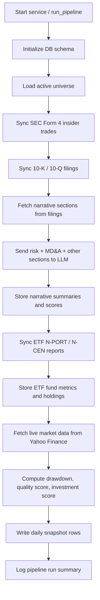
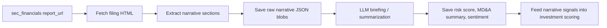

# Drawdown Analyzer - Standalone Python Data Pipeline

This project now uses a `src/` layout. The core package lives under `src/stock_hunter/` and the debug scripts live under `tools/debug/`.

---

## 📁 Directory Structure

```
stock_hunter/
├── README.md
├── requirements.txt
├── run.sh
├── activate_and_run.sh
├── ui/
│   ├── __init__.py
│   ├── app.py
│   └── db.py
├── src/stock_hunter/
│   ├── ai_narrative.py
│   ├── pipeline.py
│   ├── query_db.py
│   ├── schema.py
│   ├── sec_edgar_worker.py
│   ├── sec_etf_worker.py
│   ├── sec_financials_worker.py
│   ├── sec_narrative_worker.py
│   └── service.py
├── tests/
└── tools/debug/
```

---

## 🚀 Quick Start Instructions

### Option A: Standard `requirements.txt` with venv

```bash
source venv/bin/activate
python -m pip install -r requirements.txt
export PYTHONPATH=src
```

### Option B: Pipenv (`Pipfile`)

```bash
pipenv install
pipenv shell
```

---

## 📊 Local Streamlit Dashboard

The project includes a read-only Streamlit app that reads directly from SQLite.

Install dependencies first:

```bash
source venv/bin/activate
python -m pip install -r requirements.txt
```

Run the dashboard:

```bash
source venv/bin/activate
streamlit run ui/app.py
```

Streamlit runs with automatic reload by default, so edits to `ui/app.py` or supporting files will refresh the page while the server is running.

If file watching feels slow or reloads lag, install the optional watchdog package:

```bash
source venv/bin/activate
python -m pip install watchdog
```

Browser URL:

- `http://localhost:8501`
- If Streamlit chooses a different port, it prints the exact local URL in the terminal when the server starts.

How to check whether Streamlit is already running:

```bash
pgrep -af 'streamlit run ui/app.py|streamlit'
```

You can also check the port directly:

```bash
lsof -i :8501
```

If those commands return nothing, the Streamlit server is not running.

What it shows:

- summary cards for active tickers, snapshot rows, financial rows, LLM-enriched rows, ETF rows, and pipeline runs
- ticker search in the sidebar
- ticker overview charts for price history and filing-score trends
- filing history and filing detail for each ticker
- narrative section tabs for MD&A, risk factors, legal, commitments, buybacks, liquidity, and subsequent events
- recent pipeline run history plus a run-details panel
- optional auto-refresh while the backend pipeline is running

The dashboard is read-only. It does not write back to the database.

---

## ⚙️ Running the Pipeline & Daemon Service

### 1. Initialize the SQLite Database

Run the schema module to create `drawdown_analyzer.db` with normalized tables (`universe`, `daily_snapshot`, `price_history`, `insider_trades`, `sec_financials`, `sec_etf_reports`, `etf_holdings`, `eight_k_events`, `drawdown_events`, `drawdown_summary`, `distress_scores`, `congress_trades`, `pipeline_runs`):

```bash
PYTHONPATH=src python -m stock_hunter.schema
```

### Analytics added on top of SEC filing data

Each pipeline run now also computes, per active ticker:

- **Price history backfill** – a one-time 5-year backfill per ticker (then incremental daily updates), stored in `price_history`, so drawdown analysis has real multi-year series to work with.
- **Drawdown/recovery analytics** (`drawdown_analytics.py`) – every peak-to-trough-to-recovery episode at or beyond a 5% threshold, plus summary stats (count by severity, average/median/worst drawdown, average/longest recovery, current drawdown, and historical recovery-probability buckets) in `drawdown_events` / `drawdown_summary`.
- **Financial-distress estimate** (`distress_analytics.py`) – Altman Z-score and a best-effort Piotroski F-score (using year-over-year 10-K comparisons where two years of data exist) blended into a 0-100 `distress_risk_score` with probabilistic wording ("Low financial-distress risk" / "Elevated financial-distress risk" / "Material solvency concerns" / "Insufficient data"), stored in `distress_scores`. Note: Altman Z is designed for non-financial firms and reads unreliably low for banks/insurers by construction — treat it as one signal among several, not a verdict.
- **8-K debt/bankruptcy event tracking** (`sec_eightk_worker.py`) – ingests 8-K filings whose item codes indicate new debt, covenant triggers, refinancing, delisting, auditor changes, or bankruptcy (items 1.01, 1.02, 1.03, 2.03-2.06, 3.01, 4.01), stored in `eight_k_events`. A bankruptcy-item 8-K forces the composite risk score to "high" regardless of other inputs.
- **Insider sentiment scoring** (`scoring.py`) – aggregates `insider_trades` over a trailing 180-day window into a 0-100 score, weighting open-market purchases/sales (codes `P`/`S`) far more heavily than grants, option exercises, tax withholding, or gifts (`A`/`M`/`F`/`G`), so routine equity-comp activity doesn't drown out genuine buying/selling signal.
- **Composite risk / quality / investment scores** (`scoring.py`) – combine the above with live valuation (PE, FCF yield, dividend yield, EV/EBITDA), the LLM-derived filing risk score, and legal/regulatory sentiment into `daily_snapshot.risk_score`, `quality_score`, and `investment_score`.

These run automatically as part of `run_pipeline()` / `stock_hunter.service` — no separate command is needed.

### 2. Run as a One-Shot Execution or Background Service Daemon

Run one-shot sync:
```bash
PYTHONPATH=src python -m stock_hunter.service
```

Run one-shot sync while skipping Form 4 ingestion:
```bash
PYTHONPATH=src python -m stock_hunter.service --skip-form4
```

Run one-shot sync while skipping SEC 8-K debt/bankruptcy event ingestion:
```bash
PYTHONPATH=src python -m stock_hunter.service --skip-8k
```

Reset only the filing/narrative table and start fresh:
```bash
PYTHONPATH=src python -m stock_hunter.service --skip-form4 --reset-financials
```

Resume just the LLM narrative scoring pass from the existing `sec_financials` rows:
```bash
PYTHONPATH=src python -m stock_hunter.service --resume-llm
```

Use this when the filing rows and narrative JSON are already in SQLite, but the run stopped during the LLM step.
Do not combine `--resume-llm` with `--reset-financials`.

Run as a continuous background service (e.g. sync every 60 minutes):
```bash
PYTHONPATH=src python -m stock_hunter.service --daemon --interval 60
```

Run the daemon and skip Form 4 ingestion:
```bash
PYTHONPATH=src python -m stock_hunter.service --daemon --interval 60 --skip-form4
```

Or run the 10-K/10-Q financial filings worker individually:
```bash
PYTHONPATH=src python -m stock_hunter.sec_financials_worker
```

### Fresh Start

If you want to rebuild everything from scratch, run these three commands in order:

```bash
rm -f drawdown_analyzer.db
PYTHONPATH=src python -m stock_hunter.schema
PYTHONPATH=src python -m stock_hunter.service --skip-form4 --reset-financials
```

The first command removes the local SQLite database file.
The second recreates the schema.
The third seeds the pipeline from the beginning with a clean financials table.

---

## 🔁 Pipeline Flow

The main service executes in this order:



### What happens at each step

| Step | What the code does | What gets saved to SQLite |
| --- | --- | --- |
| 1 | Initializes schema and seeds the default universe if needed | `universe`, `daily_snapshot`, `price_history`, `insider_trades`, `sec_financials`, `sec_etf_reports`, `etf_holdings`, `pipeline_runs` |
| 2 | Loads all active tickers from `universe` | No new writes |
| 3 | Fetches SEC Form 4 filings and parses insider transactions | `insider_trades` |
| 4 | Fetches 10-K and 10-Q filing metadata and narrative sections | `sec_financials` rows and narrative columns |
| 5 | Fetches narrative sections from filing HTML when missing | `narrative_mda`, `narrative_risk_factors`, `narrative_legal`, `narrative_commitments`, `narrative_buybacks`, `narrative_liquidity`, `narrative_subsequent` |
| 6 | Sends risk factors and MD&A plus other sections to the LLM briefing layer | `risk_score`, `risk_summary`, `risk_sentiment`, `md_a_summary`, `full_sentiment`, `comprehensive_summary` |
| 7 | Fetches ETF N-PORT / N-CEN filings | `sec_etf_reports` |
| 8 | Parses ETF holdings from N-PORT documents | `etf_holdings` |
| 9 | Pulls latest Yahoo Finance prices and fundamentals | `price_history`, `daily_snapshot`, and `universe.market_cap` / `last_updated` |
| 10 | Computes drawdown and investment scores using valuation + narrative risk | `daily_snapshot.quality_score`, `daily_snapshot.investment_score`, `daily_snapshot.valuation_tier`, `daily_snapshot.investment_verdict` |
| 11 | Writes an execution record | `pipeline_runs` |

### Narrative scoring path

The narrative part is the key value-add:



This means the score is not just based on price and valuation. It also includes:

- risk-factor severity
- MD&A tone and summary
- overall filing sentiment
- ETF-specific SEC metrics when applicable
- SEC companyfacts numeric fields when available

### SEC pull strategy

- `Form 4` insider filings are pulled per stock/CIK from the SEC submissions API.
- `N-PORT` / `N-CEN` filings are pulled per ETF/CIK from the SEC submissions API.
- The code does not do one global SEC pull and then try to map everything afterward. It iterates ticker by ticker.
- For stock filings, the worker keeps all `10-K` and `10-Q` rows from the last 365 days.
- The numeric filing fields in `sec_financials` are populated from SEC `companyfacts` data.
- The LLM step runs only on the latest `10-K` per ticker.
- You can skip the Form 4 step entirely with `--skip-form4` when rerunning after the insider data is already loaded.
- Even when Form 4 is enabled, duplicate database writes are prevented by the `insider_trades` unique constraint plus `INSERT OR IGNORE`.

### LLM call budget

- `Form 4` parsing uses no LLM calls.
- `N-PORT` / `N-CEN` parsing uses no LLM calls.
- The LLM is used only for the latest 10-K narrative briefing in `sec_financials_worker.py`.
- Per filing, the current flow can make up to 8 LLM calls:
  - 1 for risk factors
  - 1 for MD&A
  - 1 each for legal, commitments, buybacks, liquidity, and subsequent events
  - 1 for the combined narrative briefing
- With the latest-10-K-only stock pull, the upper bound is `8` LLM calls per stock.
- If a filing is missing some narrative sections, the actual call count can be lower.
- In the current seeded universe, the SEC work is driven by 165 stocks and 21 ETFs, but only the narrative-bearing 10-K / 10-Q rows trigger LLM usage.

If you want to reduce LLM cost later, the next optimization is to add a “summarized already” flag so the worker skips rows that were processed in a previous run.

### Narrative provider switch

The narrative layer is driven by environment variables:

- `NARRATIVE_PROVIDER=openai|cohere|nim`
- `NARRATIVE_MODEL=<provider model name>`
- `NARRATIVE_MAX_RPS=<requests per second>`
- `NARRATIVE_FALLBACK_PROVIDER=nim` to fail over on HTTP 429 from the primary provider
- `NARRATIVE_FALLBACK_MODEL=<fallback provider model name>` if the failover provider needs a different model

If you change `NARRATIVE_PROVIDER`, you also need to set the matching API key:

- `openai` uses `OPENAI_API_KEY`
- `cohere` uses `COHERE_API_KEY`
- `nim` uses `NVIDIA_NIM_API_KEY` and `NVIDIA_NIM_API_BASE`

So yes, the goal is that provider switching becomes an env change, not a code change.
The current implementation already routes OpenAI, Cohere, and NVIDIA NIM through the same narrative interface.
If the primary provider returns HTTP 429 and `NARRATIVE_FALLBACK_PROVIDER` is set, the worker will retry that same request once against the fallback provider instead of stopping the pipeline.

### Database tables at a glance

- `universe`: the active ticker list and classification metadata
- `price_history`: 30-day rolling close/volume history per ticker
- `daily_snapshot`: latest price, drawdown, valuation, and score snapshot
- `insider_trades`: Form 4 insider transaction records
- `sec_financials`: 10-K / 10-Q filing metadata, narrative text, and LLM outputs
- `sec_etf_reports`: ETF filing metadata and fund-level metrics
- `etf_holdings`: holdings extracted from ETF filings
- `pipeline_runs`: run history and execution summary

### Rerun behavior

- `insider_trades`, `price_history`, `sec_etf_reports`, and `etf_holdings` are deduped at the database layer.
- `daily_snapshot` is refreshed per ticker, so the latest run replaces the prior snapshot row.
- `sec_financials` is keyed by filing identity, then enriched in place with narrative text and LLM outputs.
- `pipeline_runs` always gets a new row for each execution.
- If you already loaded Form 4 data and want to avoid the extra SEC requests, use `--skip-form4`.
- If you want to rebuild only the filing/narrative side without touching Form 4 or ETF tables, use `--reset-financials`.
- `--reset-financials` will now rebuild the last 365 days of `10-K` and `10-Q` filings instead of a 5-year filing history.
- If the SEC filing rows already exist and the pipeline failed during the LLM pass, use `--resume-llm` to continue from Step 1b without refetching filings or reprocessing complete LLM rows.

### 4. Query 10-K and 10-Q Financials from the SQLite Database

Run the query helper to inspect top drawdowns, SEC Form 4 insider trades, and 10-K / 10-Q financial reports from terminal:

```bash
PYTHONPATH=src python -m stock_hunter.query_db
```

Or query `sec_financials` directly in SQLite:
```bash
sqlite3 drawdown_analyzer.db
```
```sql
SELECT ticker, form_type, filing_date, fiscal_year, revenue_usd, net_income_usd, operating_income_usd, total_assets_usd, total_liabilities_usd, stockholders_equity_usd, eps_diluted, report_url
FROM sec_financials
WHERE form_type IN ('10-K', '10-Q')
ORDER BY filing_date DESC
LIMIT 20;
```

The numeric columns above are filled from SEC `companyfacts` when available.

To verify that narrative summaries are being written, run:
```sql
SELECT
  ticker,
  form_type,
  filing_date,
  accession_number,
  risk_score,
  risk_summary,
  md_a_summary,
  full_sentiment,
  comprehensive_summary,
  (CASE WHEN narrative_mda IS NOT NULL THEN 1 ELSE 0 END +
   CASE WHEN narrative_risk_factors IS NOT NULL THEN 1 ELSE 0 END +
   CASE WHEN narrative_legal IS NOT NULL THEN 1 ELSE 0 END +
   CASE WHEN narrative_commitments IS NOT NULL THEN 1 ELSE 0 END +
   CASE WHEN narrative_buybacks IS NOT NULL THEN 1 ELSE 0 END +
   CASE WHEN narrative_liquidity IS NOT NULL THEN 1 ELSE 0 END +
   CASE WHEN narrative_subsequent IS NOT NULL THEN 1 ELSE 0 END) AS narrative_sections_present
FROM sec_financials
WHERE ticker = 'AAPL'
ORDER BY filing_date DESC;
```

### Real LLM integration test

Run this only when you want to hit the real provider API:

```bash
RUN_REAL_LLM_TESTS=1 PYTHONPATH=src python -m unittest tests.test_financials_integration
```

It requires:
- `NARRATIVE_PROVIDER=openai|cohere|nim`
- the matching API key in `.env` or your shell environment

## Troubleshooting

### SQLite is locked

If you see `sqlite3.OperationalError: database is locked`, another process is usually still holding `drawdown_analyzer.db` open.

Check for active holders:
```bash
lsof drawdown_analyzer.db
```

You can also search for active `stock_hunter` or `sqlite3` processes:
```bash
pgrep -af 'stock_hunter|sqlite3'
```

If you find an old `python -m stock_hunter.service` run, an open `sqlite3` shell, or a DB viewer, close it or stop that process, then rerun the pipeline.

If needed, you can also inspect and kill the process directly:
```bash
kill <PID>
```

### Stop the pipeline

Press `Ctrl+C` to stop the one-shot pipeline or daemon. The service now exits cleanly on interrupt.
